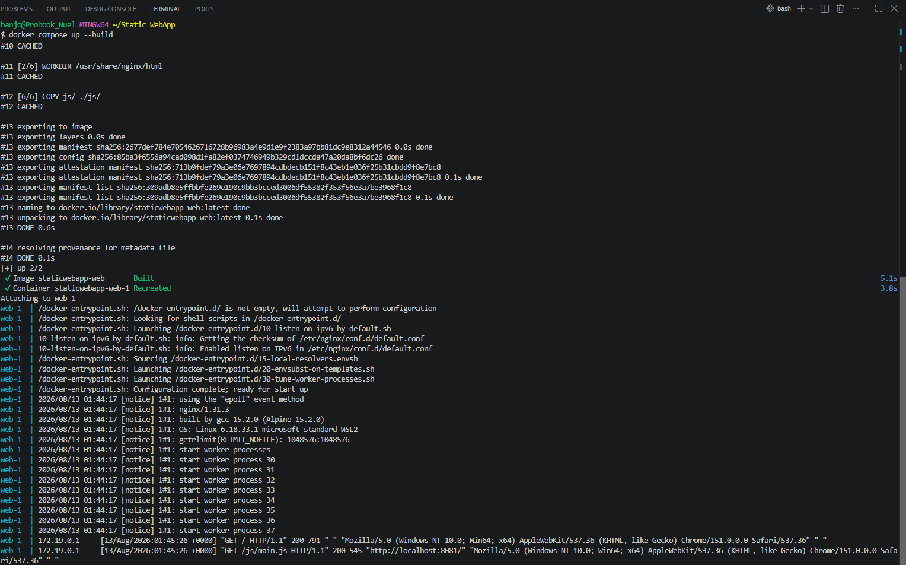
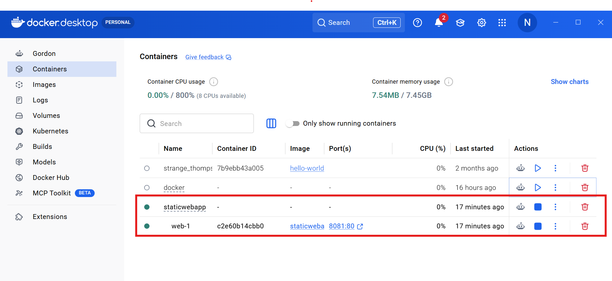
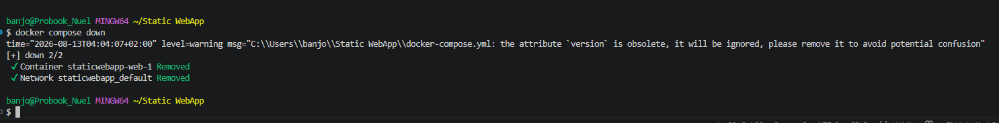

# Emmanuel's Paradise 👌😎 

Here is a minimalistic static web app built and containerized with Nginx and Docker. It has an option to edit the contents without having to rebuild the image. 

---

## Project details 📑

In this project, I used a lightweight Nginx web server containerized with Docker, serving a single static HTML page. It spans across topics such as core Dockerfile instructions, container lifecycle and port mapping. As an added feature, I mounted a volume so I can edit `index.html` (which contains the static webapp page output) and see the changes after every refresh. 

---

## Project outline 🔳

```
Static Webapp/
├── .github/
|   └── workflows/
|       └── docker-publish.yml
├── css/
|   └── style.css
├── js/
|   └── main.js
├── Dockerfile
├── LiCENSE
├── about.html
├── contact.html
├── docker-compose.yml
├── index.html
└── README.md

```
---

## Application source `(index.html)` 🤖

```html
<!DOCTYPE html>
<html lang="en">
<head>
    <meta charset="UTF-8">
    <meta name="viewport" content="width=device-width, initial-scale=1.0">
    <title>Welcome to Emmanuel's Paradise ❤️😎</title>
    <link rel="stylesheet" href="css/style.css">
</head>
<body>
    <nav>
        <a href="index.html">Home</a>
        <a href="about.html">About</a>
        <a href="contact.html">Contact</a>
    </nav>
    <main>
        <h1>Emmanuel is a DevOps Engineer! 👌🙌</h1>
        <p>DevOps journey with Skill.Sch</p>
        <p>Powered by Docker and Nginx</p>
        <button id="greet-btn">Say hello my oga!</button>
    </main>
    <footer>&copy; 2026 Emmanuel &mdash; built with Docker &amp; Nginx</footer>
    <script src="js/main.js"></script>
</body>
</html>

```
---

## Dockerfile 📄

```dockerfile
FROM nginx:alpine

WORKDIR /usr/share/nginx/html

RUN rm -rf ./*

COPY index.html about.html contact.html ./
COPY css/ ./css/
COPY js/ ./js/

EXPOSE 80

CMD ["nginx", "-g", "daemon off;"]

```
---

## Steps to run 🏃‍♂️

- ### Create the folder structure 
    _In your new project root folder, use the terminal to add a few more folders_

    ```bash
    mkdir css js
    mkdir -p .github/workflows
    ```
- ### Add other files
    _To add other files in the Explorer window, right-click an empty space and choose New file. Name these files according to the structure explained earlier (index.html, about.html, contact.html, Dockerfile, docker-compose.yml, README.md)_

- ### Add content to the build components

- ### Test the build locally

   _In VS Code terminal, from the project root:_

```bash
   docker compose up --build
```
_once this completes, go to `http://localhost:8081` and this should show the homepage with working navigation links_

---

## Results 🧾

- Build output (```docker compose up --build```)

   


- Landing page (`http://localhost:8081`)

   


- About page

   

- Contacts page 

   

- Say hello

   

- Local confirmation

   

---

## Tear down the build

- Run 

```bash
    docker compose down
```

  

---

## Push to Github

- Before pushing to github, create an empty repo in your Github

- Then in your VS Code terminal, run
```bash
    git init
    git add .
    git commit -m "initial commit"
    git branch -M main
    git remote add origin https://github.com/<your-username>/<your-repo-name>.git
    git push -u origin main
```
---

## Note 📄📄

_In the dockerfile, running `CMD ["nginx"]` alone causes Nginx to run in the background and the container to exit right after starting. Adding the pass `-g "daemon off;"` keeps it in the foreground._

---


_This is my personal project (C) Emmanuel's DevOps journey_